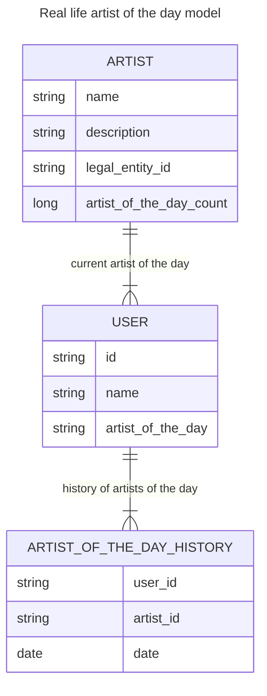
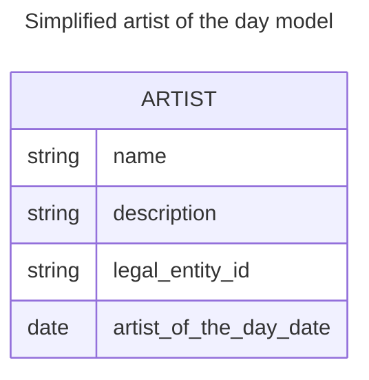

# Artist of the day real world solution

The aim is to make users discover new artists.

For the artist of the day real life feature I would make the following assumptions:
- each user who asks for the artist of the day can be identified, e.g. cookies, ip, mac address...
- at least 1 artist is created every day on average. -> cyclical promotion for new artists is not really feasible as the cycle would never end.
- two users who are asking for the artist of the day on the same day can get different artists.
- if a user is asking for the artist of the day multiple times on the same day, they will get the same artist
- a day is defined as a 24 hour period starting from the first time a user asks for the artist of the day.
  This means that if a user asks for the artist of the day at 10:00 AM, they will get the same artist until 10:00 AM the next day.
  After 10:00 AM the next day, they will get a new artist if they ask for the artist of the day again.
    - This would make testing easier
    - We will not need to worry about time zones and daylight saving time changes.
    - The selected artist of the day for a user can be stored in a cache and expires after 24 hours. -> each request that hits the service can generate a new artist of the day.
- I will assume that if a legal entity is represented by multiple artist aliases then each alias can be the artist of the day.

## Equal representation in real life scenario:

To ensure that all artists have an equal chance of being the artist of the day,
I will use a random selection algorithm that takes into account the number of times each artist has been selected as the artist of the day.

Each time an artist is featured as the artist of the day, I will increment a counter for that artist.
The new artist of the day will be selected randomly from the pool of artists that has the lowest artist of the day count.
To not promote the same artist for the same user two times in a row,
we can keep a history of the artist of the day and exclude these artists.
Because we assume creating more than one artist every day this will not lead to a situation where we are running out of artists to select from.
(If the event happens than we can start with the oldest artist of the day from the history.)

New artists will be added to the pool with an artist of the day count of the lowest artist in the system.
In this way the new artist will not be overrepresented in the first requests.

# Artist of the day Simplified solution

Assumptions for the take home project:
- the artist pool is constant.
- the day starts at 00:00 UTC and ends at 23:59 UTC.
- all users will get the same artist of the day.

## Equal representation in the simplified solution

The system will select a random artist from the artist pool every time when there is no artist of the day selected for the day.
The selected artist will be marked with the date of the selection.
This will be the basis of the order if we are running out of artists who hasn't been selected yet.

