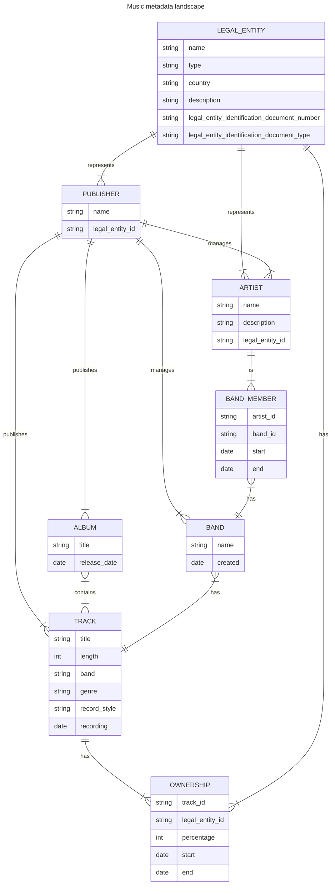
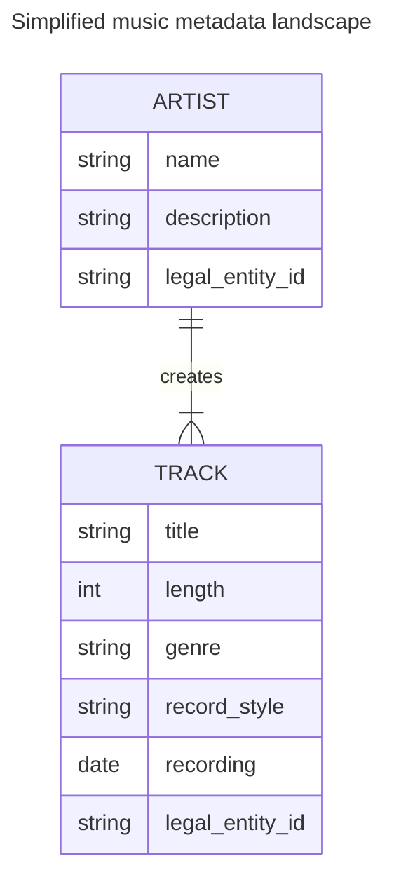

# Domain

This is a high level overview of the music metadata landscape. 
It is not meant to be exhaustive, but rather to give an idea of the main entities and their relationships.
This domain doesn't include artist of the day feature.

# Simplified domain

Clearly this is too complex for a take home interview project so I will implement the following domain to satisfy the requirements of the project:
- I will assume that a track is created by one artist.
- I will assume that a track is owned by one legal entity.
- A legal entity can be represented by multiple artists (aliases).
- I will not model publishers, bands, albums, or ownership percentages.
- I will not model the history of artists, bands, or ownership. I will assume that the history of these are recorded by another part of the system which can be queried easily by the client applications.
- I will assume that the legal entity is the user who logs in to the system and managed by the authentication system.

This means that the legal entity doesn't need to be stored in this system. 

